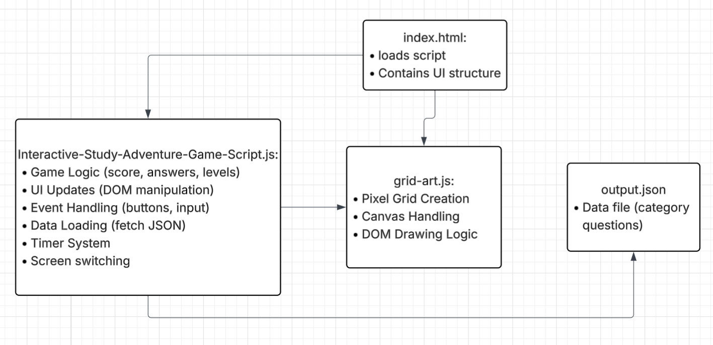
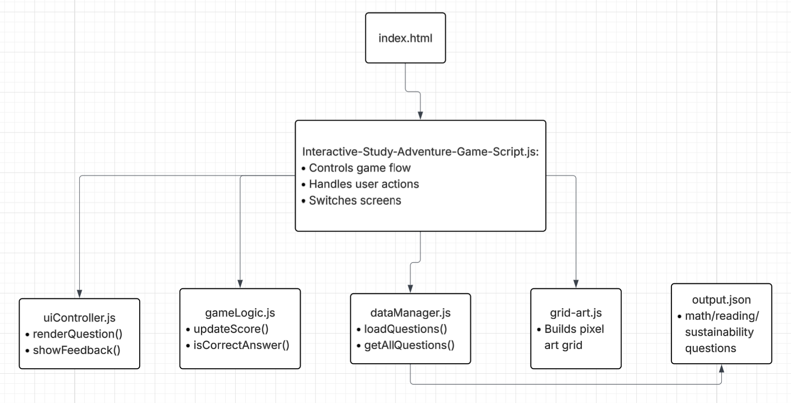

# Assignment 3 – Refactoring Code

---

## Task 1A: Current Architecture

### Overview
In the current version of the project, most of my JavaScript code is written inside one large file called `Interactive-Study-Adventure-Game-Script.js`. This includes game logic, UI updates, event handling, data loading, and timer functionality.

### JavaScript Files - What each file does:

**index.html**
- Loads the structure/layout of the game

**Interactive-Study-Adventure-Game-Script.js**
- Game logic (score, answers, levels)
- UI updates (DOM manipulation)
- Event handling
- Data loading (JSON)
- Timer system
- Screen navigation

**grid-art.js**
- Creates the pixel grid for the art category
- Canvas state handling
- DOM drawing logic

**output.json**
- Stores all the question data for all 3 categories (math, reading, sustainability)

### Problem with Current Design
- Too many responsibilities inside one big file
- Hard to read, maintain, and debug
- UI, logic, and data are all mixed together

---

## Task 1B: Proposed Modular Design

### uiController.js
- Handles all UI updates
- Functions: renderQuestion(), showFeedback()

### gameLogic.js
- Handles scoring and answer checking
- Function: updateScore(), isCorrectAnswer()

### dataManager.js
- Loads question data from JSON file
- Function: loadQuestions(), getAllQuestions()

### grid-art.js
- Handles the pixel art grid system
- Function: createGrid()

### main.js
- Controls game flow
- Connects all modules together

### Refactoring Improvements - Why is this more efficient:
- Each file has one job/responsibility
- Separates UI, logic, and data
- Reduces duplicated code 
- Improves readability and maintainability

---

## Task 2: Refactor Changes

### Refactor 1: Game Logic Separation
I moved scoring and answer checking into `gameLogic.js` to separate logic from the UI updates.

### Refactor 2: UI Controller Separation
I moved UI-related fucntions into `uiController.js` to interface updates from game logic.

### Refactor 3: Data Management Separation
I moved JSON loading into `dataManager.js` to isolate data handling from game logic.

---

## Task 3: Reflection (SUBMIT IN CANVAS, NOT HERE)
